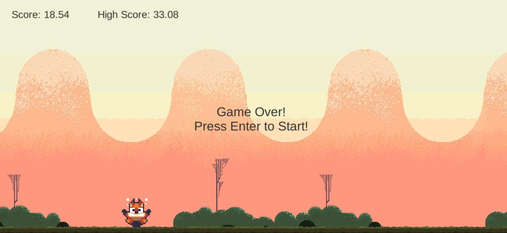
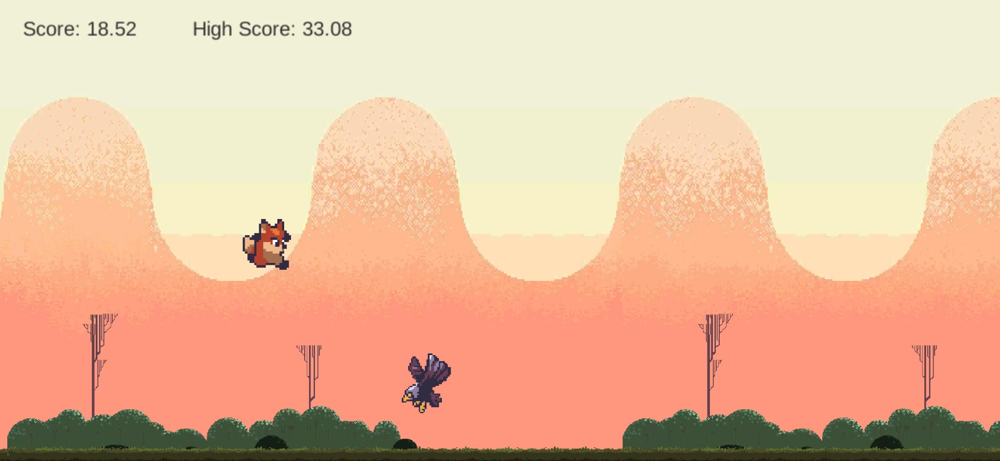

`Run Leo Run!` is a 2D endless runner game developed with Unity. Free assets are used in the development of the game. Implemented features/mechanisms are score system, movement, NPC generation and animations.

Toolkit: Unity, C#, Git

